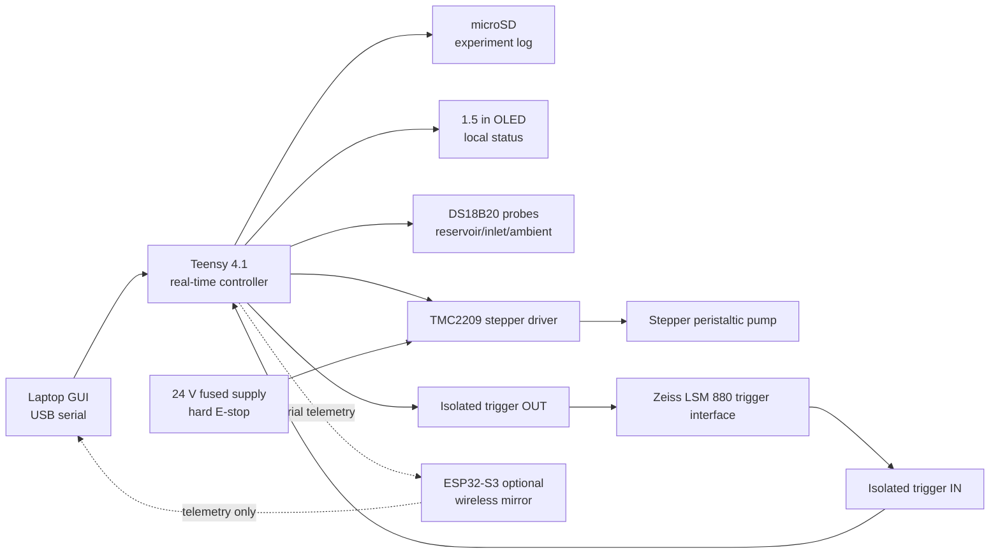

# Electronics — controller, pressure, and bring-up

> Merged from `electronics_controller_architecture.md`, `chamber_pressure_system.md`, and `electronics_bringup_checklist.md` from the dev archive. Section dividers (`---`) preserve source boundaries; source heading levels demoted by one level.

## Contents

1. **Controller Architecture** — Teensy 4.1 + TMC2209 stepper driver + isolated BNC trigger interface; pump control strategy; safety architecture; tentative Teensy pin map; firmware module layout.
2. **Flow & Shear Measurement System** — Sensirion SLF3S-1300F inline liquid flow sensor in the controller; closed-loop shear stabilization via flow + Hagen-Poiseuille geometry mapping; pulsation dampeners; digital twin; LSM 880 frame-marker time alignment; calibration protocol. Per-chamber validation against a separate gas-side differential-pressure rig (DFRobot SEN0343 / All Sensors LWLP5000 + standpipes + Millex-FG separators) is described under "Validation methodology" and `docs/protocol.md` § "Per-chamber sensor validation".
3. **Bench Bring-Up Checklist** — the procedural test sequence; bench setup table; suggested first wiring map; pump calibration; microscope trigger validation; wet-run gate.

> **Cross-references:** body sections reference `design_spec_v2.md` (split → `docs/theory.md` + `docs/architecture.md`) and `Sensor Survey for Wall Shear Stress.md` (moved → `literature/sensor_survey_wall_shear.md`). In-body cross-references have **not** been updated.

> **Geometry note:** the pressure-system section uses the canonical 24 mm × 50 mm × 0.25 mm geometry with μ = 0.9 mPa·s. The bring-up section is geometry-independent.

---

## Electronics And Controller Architecture

This document is the working controller design for the open-source flow chamber. It supersedes the electronics assumptions in `2photon_flow_chamber_v2.md` where the two conflict.

Goal: make the chamber behave like a small research instrument, not a pile of lab electronics. The controller must deliver repeatable shear stimulus, log the exact stimulus timing, and remain buildable by an undergraduate lab. Microscope protection comes from chamber design (sealed, autoclavable, no exposed electrodes) and operator-side visual monitoring; dedicated leak detection is out of scope for the current spec.

### Primary Decision

Use the Teensy 4.1 as the real-time controller.

Use the ESP32-S3 only as an optional wireless/status coprocessor later. It should not own pump timing, microscope trigger timing, or the authoritative experiment log.

Why:

- Teensy 4.1 has deterministic timers, native high-speed USB, onboard microSD, many serial/SPI/I2C ports, and enough GPIO for this system.
- ESP32-S3 is excellent for WiFi/BLE, but wireless and RTOS scheduling should not sit in the critical path for pump timing or safety shutdown.
- The open-source reference build should work without WiFi, cloud services, or network configuration.

### System Roles

| Function | Primary implementation | Notes |
|---|---|---|
| Pump timing | Teensy 4.1 hardware timer | Step pulse generation must not depend on laptop timing |
| TMC2209 configuration | Teensy UART | Current, microstepping, diagnostics |
| Flow protocol engine | Teensy state machine | Baseline, ramp, hold, recovery |
| Temperature logging | DS18B20 probes on Teensy OneWire | Reservoir, inlet, ambient/stage |
| Pump shutdown | Hard 24 V enable cut + firmware STOP | Physical switch/fuse on the motor rail; firmware-side STOP disables the TMC2209 ENABLE pin |
| Microscope sync | Isolated BNC trigger board | The i880 interface must remain electrically isolated |
| Experiment log | Teensy microSD | Teensy timestamp is authoritative |
| Live GUI | Laptop over USB serial | Optional for run control and plotting |
| Local display | Waveshare OLED on Teensy SPI | Useful for standalone status |
| Wireless mirror | ESP32-S3 optional | Telemetry viewer only, not safety-critical |

### Practical Electrical Architecture

The original notes proposed three fully galvanically isolated domains. That is the right instinct for the microscope, but it is too easy to claim false isolation with a commodity TMC2209 module.

Most TMC2209 carrier boards tie motor ground and logic ground together. If the Teensy drives the TMC2209 while both boards share ground, optocouplers on STEP/DIR do not create real galvanic isolation. True motor-domain isolation would require:

- an isolated DC/DC supply for the motor-driver logic side;
- isolators on every signal crossing: STEP, DIR, ENABLE, UART TX/RX, DIAG if used;
- a driver carrier or custom board whose logic reference can actually remain separate;
- no shared USB, shield, sensor, or chassis path between domains.

For the first paper-grade build, use this more defensible split:

1. **Logic/motor domain inside the controller box**
   - Teensy, TMC2209, display, sensors, and 24 V motor driver live in one controlled enclosure.
   - Tie logic ground and motor ground at a deliberate star point near the power entry/driver.
   - Keep motor wiring physically separated from analog/trigger wiring.
   - Use local bulk capacitance and fusing on the 24 V rail.

2. **Microscope domain isolated absolutely**
   - No direct electrical connection from Teensy ground to the i880 trigger BNC shield or center conductor.
   - Use optocoupler or digital isolator circuitry for trigger OUT and trigger IN.
   - Test the isolated trigger board on the bench before connecting to the microscope.

3. **Fluidic/chamber metal kept electrically passive**
   - Do not intentionally bond chamber steel to Teensy ground.
   - Do not put powered sensors in the wetted fluid path.

This is simpler, safer, and easier to explain in an open-source build guide.

### Block Diagram



### Inventory Assessment

#### Use Now

| Item | Use | Action |
|---|---|---|
| Teensy 4.1 | Main controller | Lock as primary |
| Teensy terminal block breakout | Harness interface | Use for first wired build |
| TMC2209 drivers, qty 2 | Pump driver and spare/future second pump | Use one, keep one spare |
| 64 GB microSD | SD logging | Use onboard Teensy SDIO socket |
| DS18B20 probes, qty 5 | Temperature logging | Use 3 initially; keep spares |
| 4.7k resistors | OneWire pull-up | Use one from DQ to 3.3 V |
| RGB OLED 1.5 in | Local status panel | Prefer this for colored state cues |
| EC11 encoders | Local control | Use one primary encoder with push button |
| Logic analyzer | Bring-up | Verify STEP frequency, UART, trigger timing |
| Fuse holders and blade fuses | 24 V motor rail | Use 1 to 2 A fuse to start, adjust after pump current is known |
| Ferrules, heat shrink, silicone wire | Harnessing | Use for final wiring |
| Ferrule crimper | Harnessing | Use with ferrules before landing stranded wire in screw terminals |

#### Use Later Or Optional

| Item | Recommendation |
|---|---|
| ESP32-S3 N16R8 | Optional wireless dashboard/logger mirror. Do not use as the real-time controller. |
| Grayscale OLED | Backup display or secondary diagnostic display. Not needed initially. |
| LIS3DSH accelerometers | Optional pump vibration and stage disturbance logging. The part is out of production, so do not make it a required open-source component. |
| I2S MEMS microphone | Not part of the core flow chamber. Only consider later for exploratory acoustic pump diagnostics. |

#### Missing Before Full Controller Build

| Item | Why it matters |
|---|---|
| Confirmed pump and stepper wiring | Motor current, steps/rev, connector, and tubing calibration drive firmware constants |
| 24 V DC power supply | Required for pump/TMC2209 |
| Isolated BNC trigger board parts | Protects the i880 and the laptop from ground-loop paths |
| Enclosure and panel hardware | No loose breadboard on the microscope |
| E-stop or latching motor-power switch | Physical pump shutdown independent of firmware |
| TMC2209 heatsink / airflow plan | Avoid driver thermal faults |
| Multimeter and ideally oscilloscope access | Logic analyzer is enough for digital timing, but analog voltage checks still matter |

### Recommended Controller Enclosure

Make the electronics box a separate TX-6-inspired instrument:

- satin metal or light polymer enclosure;
- small OLED top/right;
- one encoder for setpoint selection;
- three buttons: `prime`, `run`, `stop`;
- small orange indicator for `flow active` or `alarm`;
- BNC trigger connector on one side;
- separate motor, sensor, and USB exits;
- no loose Dupont jumpers after bring-up.

The controller enclosure does not need to fit on the microscope stage. Keep it off-stage with strain-relieved harnesses.

### Trigger Interface

The Zeiss LSM 880 trigger interface is the one place to be conservative.

A public LSM 880 operating manual mirror describes the trigger interface as 3.3 V TTL, tolerant of 5 V logic, with output load below 50 mA, a 68 ohm internal series resistor on output, and a 4.7k input pull-up to 3.3 V. It also notes that standard BNC cables are used through the optional user interface box.

Use that as a design hint, not a facility guarantee. Confirm the actual Cedars-Sinai i880 trigger box before connecting.

Recommended isolated trigger board:

| Direction | Circuit | Default behavior |
|---|---|---|
| Teensy to i880 TriggerIN | Optocoupler transistor on microscope side | Open-collector pull-down pulse, no shared ground |
| i880 TriggerOUT to Teensy | Optocoupler LED driven by BNC signal through resistor | Teensy interrupt pin sees isolated pulse |

Bench validation:

1. Verify no continuity between Teensy ground and BNC shield.
2. Drive TriggerOUT circuit from a 3.3 V test signal and inspect Teensy pin with logic analyzer.
3. Drive TriggerIN circuit from Teensy and inspect BNC side with a pull-up/resistor test load.
4. Only then connect to the microscope with core staff present.

PC817-class optocouplers are acceptable for run-start markers and 2 to 6 Hz frame/event markers. They are not appropriate for pixel clock, line clock, or nanosecond timing.

### Pump Control Strategy

The pump should be stepper-driven through TMC2209 in STEP/DIR mode. UART configures the driver; the Teensy timer generates STEP pulses.

Use 16x or 32x external microstepping and let the TMC2209 interpolate internally to 256 microsteps. Do not default to true 256x STEP input unless the measured step frequency remains comfortably low.

Core formula:

```text
step_rate_hz = flow_ml_min * calibrated_steps_per_ml / 60
```

Where:

```text
calibrated_steps_per_ml =
    motor_full_steps_per_rev * external_microsteps * pump_revs_per_ml
```

The constant must be measured gravimetrically for the actual pump head and tubing. Do not trust catalog flow curves for paper-grade shear stress.

Required pump states:

- `DISABLED`: TMC disabled, motor power present but no drive.
- `IDLE`: driver configured, pump stopped, ready.
- `RAMPING`: changing flow with bounded acceleration.
- `HOLDING`: constant target flow.
- `FAULT`: driver fault, SD failure, or explicit emergency stop.

Stimulus modes to support from the start:

- baseline no-flow period;
- ramp to target flow;
- hold target flow;
- ramp to zero;
- repeated pulses;
- later: sinusoidal or frequency-coded shear for Lewis-style mechanotransduction experiments.

### Safety Architecture

Safety should not depend only on code.

Hardware:

- fuse the 24 V rail close to power entry;
- use a latching motor-power switch or E-stop that removes 24 V from the TMC2209;
- add a pull-up so TMC `ENABLE` defaults disabled during reset;
- keep pump motor cable away from BNC and sensor wiring;
- keep all breadboards away from wet microscope operation.

Firmware:

- enable the watchdog;
- boot into pump disabled;
- refuse flow commands until sensors, SD, and driver config pass startup checks;
- shut down pump immediately on driver overtemperature, serial protocol fault during a run, or SD write failure if logging is required;
- require explicit user reset after any E-stop event.

### Temperature Sensing

Use DS18B20 probes as slow environmental sensors, not as fast thermal control feedback.

Initial channels:

- reservoir media;
- tubing immediately before the chamber, external contact or small non-wetted pocket;
- ambient/stage air near chamber;
- optional outlet/reservoir return.

Implementation notes:

- power sensors from 3.3 V, not parasite power;
- use one 4.7k pull-up from OneWire data to 3.3 V;
- map each probe's 64-bit ID to its physical location in a config file;
- request all conversions asynchronously and read back after the conversion interval;
- log at 1 Hz.

At 12-bit resolution, DS18B20 conversion time is up to 750 ms. That is fine for experiment metadata and slow drift, not for fast thermal transients.

### Optional Accelerometer Use

The LIS3DSH modules can be useful during engineering validation:

- mount one on the pump body to quantify roller/stepper vibration;
- mount one near the stage/chamber holder to detect whether pump motion is coupling into the microscope;
- log synchronized acceleration during no-flow and flow runs.

Do not include LIS3DSH in the required open-source BOM because ST lists the part as obsolete/out of production.

### Display And Manual UI

Use the RGB OLED for the main controller status because the color channel can communicate state without text-heavy UI.

Minimal local screen:

```text
FLOW  4.34 ml/min
SHEAR 1.00 Pa
TEMP  36.8 C
LOG   00:12:44
STATE HOLDING
```

Manual controls:

- encoder rotates selected value;
- encoder press switches field;
- `prime` runs low-speed pump until released or timed out;
- `run` starts loaded protocol;
- `stop` enters safe pump-disabled state.

The laptop GUI remains the main setup surface. The local UI is for priming, status, and emergency clarity.

### Revised Tentative Teensy Pin Map

Final firmware should put these in `hardware_config.h`.

| Teensy pin | Function | Notes |
|---:|---|---|
| 0 RX1 | TMC2209 UART RX | Direct if shared motor/logic ground; isolated only in full isolation build |
| 1 TX1 | TMC2209 UART TX | 115200 baud start point |
| 2 | TMC2209 STEP | Timer-driven output |
| 3 | TMC2209 DIR | Direction output |
| 4 | TMC2209 ENABLE | Use pull-up so driver defaults disabled |
| 5 | i880 trigger OUT LED drive | Drives isolated output board |
| 6 | i880 trigger IN isolated output | Interrupt-capable input |
| 7 | Reserved | Free for future use |
| 8 | OLED RST | SPI display |
| 9 | OLED DC | SPI display |
| 10 | OLED CS | SPI display |
| 11 | SPI MOSI | OLED, optional SPI sensors |
| 12 | SPI MISO | Optional diagnostics/sensors |
| 13 | SPI SCK | OLED; also onboard LED pin, acceptable |
| 14 / A0 | Reserved analog in | 0 to 3.3 V only; free for future use |
| 15 / A1 | Reserved analog in | 0 to 3.3 V only; free for future use |
| 16 / A2 | Reserved analog in | 0 to 3.3 V only; free for future use |
| 17 / A3 | Reserved analog in | 0 to 3.3 V only; free for future use |
| 18 SDA | I2C optional | LIS3DSH or future sensors |
| 19 SCL | I2C optional | LIS3DSH or future sensors |
| 20 | OneWire DS18B20 bus | 4.7k pull-up to 3.3 V |
| 21 | Buzzer or alarm LED | Optional, add if purchased |
| 22 | TMC DIAG/fault | Optional driver diagnostic input |
| 24 | Encoder A | Local UI |
| 25 | Encoder B | Local UI |
| 26 | Encoder switch | Local UI |
| 28 | Pump 2 STEP | Reserved for second driver |
| 29 | Pump 2 DIR | Reserved |
| 30 | Pump 2 ENABLE | Reserved |

Important: Teensy 4.1 pins are 3.3 V only and not 5 V tolerant. Any external 5 V signal must be level shifted or isolated.

### Firmware Architecture

Use cooperative state machines plus timer interrupts.

Modules:

- `hardware_config.h`: pins, constants, calibration.
- `pump_control`: TMC2209 init, step timer, ramp planner.
- `protocol_runner`: baseline/ramp/hold/recovery script engine.
- `sensors`: DS18B20, optional accelerometer.
- `trigger_io`: isolated BNC trigger in/out.
- `logger`: SD file creation, buffering, flush policy.
- `serial_protocol`: host commands and telemetry.
- `safety`: watchdog, fault latch, shutdown rules.

Timing rules:

- STEP pulse generation runs from a hardware timer.
- Trigger edge timestamp is captured immediately.
- SD writes never happen inside interrupts.
- USB serial is never allowed to block the control loop.
- Sensor polling is scheduled and nonblocking where possible.

### Serial Protocol Direction

For first bring-up, use line-oriented text commands because they are debuggable with any serial terminal:

```text
PING
SET FLOW 4.34
SET SHEAR 1.00
RUN protocol_name
STOP
PRIME 2.0
TRIGGER 10000
STATUS?
```

Telemetry can start as CSV or line-delimited JSON at 10 Hz. This is more open-source-friendly than an early binary protocol and is easily fast enough over Teensy native USB.

A binary framed protocol can be added later if telemetry expands to high-rate acceleration or multiple pumps.

### Logging

The SD log should be self-contained enough to analyze without the GUI.

Minimum CSV columns:

```text
timestamp_us,run_time_s,state,flow_setpoint_ml_min,shear_setpoint_pa,
step_rate_hz,temp_reservoir_c,temp_inlet_c,temp_ambient_c,
trigger_count,event_flags,fault_code
```

Also write a run metadata file:

- channel width/height/length;
- viscosity assumption;
- calibrated steps_per_ml;
- protocol name;
- software version;
- DS18B20 probe ID map;
- operator notes if passed from GUI;
- microscope configuration note.

### Bring-Up Sequence

Do this in order.

1. **Teensy smoke test**
   - Blink, serial console, SD card create/write/read.
   - Confirm 3.3 V rail stable.

2. **Display and encoder**
   - OLED status screen.
   - Encoder scrolls a dummy setpoint.

3. **DS18B20**
   - Read all probes.
   - Record probe IDs and physical labels.

4. **TMC2209 dry driver test**
   - No pump tubing, motor unloaded.
   - Configure current low.
   - Verify STEP frequency with logic analyzer.

5. **Pump rotation**
   - Confirm direction, enable polarity, no thermal fault.
   - Add current limit and heatsink.

6. **Isolated trigger board**
   - Bench-test no-continuity and pulse behavior.
   - Do not connect to microscope yet.

7. **Integrated dry run**
   - Run full protocol with pump disconnected from fluid.
   - Verify log file, state transitions, trigger timestamps.

8. **Water loop test**
   - Run with water off-microscope.
   - Calibrate flow gravimetrically.
   - Visually monitor every fitting and the chamber-to-cover-glass interface for drips. Wipe-test with a paper towel under the loop.
   - Tune ramp rates.

9. **Microscope trigger validation**
   - With core staff, connect only the isolated BNC board.
   - Verify ZEN receives marker or sends trigger as expected.

No wet microscope run until steps 1 through 9 are complete.

### First Firmware Milestone

Target: motor moves under Teensy control and logs timing.

Minimum feature set:

- USB serial command: `SET FLOW <ml_min>`;
- USB serial command: `STOP`;
- timer-generated STEP pulses;
- OLED showing setpoint and state;
- SD CSV with timestamp, state, setpoint, and step rate;
- TMC ENABLE defaults disabled until explicit run command.

This milestone proves the timing backbone without requiring chamber machining or microscope access.

### Ambitious Later Extensions

These are worth planning for, but not blocking RapidDirect:

- second pump channel for donor/receiver conditioned-media experiments;
- motor phase logging to correlate peristaltic ripple with calcium artifacts;
- waveform shear protocols: pulses, ramps, sinusoidal, frequency sweeps;
- ESP32-S3 wireless dashboard for remote status outside the microscope room;
- simple web export of run logs plus microscope acquisition timestamps.

### Primary Sources Checked

- PJRC Teensy 4.1 specifications: https://www.pjrc.com/store/teensy41.html
- Analog Devices / Trinamic TMC2209 product page and datasheet links: https://www.analog.com/en/products/tmc2209.html
- Analog Devices DS18B20 product page and datasheet links: https://www.analog.com/en/products/ds18b20.html
- Espressif ESP32-S3-WROOM-1 datasheet: https://documentation.espressif.com/esp32-s3-wroom-1_wroom-1u_datasheet_en.pdf
- Waveshare 1.5 inch OLED module wiki: https://www.waveshare.com/wiki/1.5inch_OLED_Module
- Waveshare 1.5 inch RGB OLED module wiki: https://www.waveshare.com/wiki/1.5inch_RGB_OLED_Module
- ST LIS3DSH product page: https://www.st.com/content/st_com/en/products/mems-and-sensors/accelerometers/lis3dsh.html
- Adafruit SPH0645 I2S microphone guide: https://learn.adafruit.com/adafruit-i2s-mems-microphone-breakout
- Public LSM 880 operating manual mirror for trigger-interface details: https://www.manualslib.com/manual/1239435/Zeiss-Lsm-880.html

---

## Chamber Pressure And Shear Verification System

This document defines the in-loop sensing stack that measures wall shear stress on the cells during a flow experiment. It supersedes the simpler "two pressure sensors at the luer ports" sketch I had been using earlier in the architecture doc and incorporates the analysis in `Sensor Survey for Wall Shear Stress.md`.

Related docs: `README.md`, `design_spec_v2.md`, `rapid_direct_design_lock.md`, `electronics_controller_architecture.md`, `electronics_bringup_checklist.md`, `microscope_i880_constraints.md`, `Sensor Survey for Wall Shear Stress.md`.

### Purpose

Wall shear stress on the cells is the primary experimental variable for the calcium-flux work. The bone mechanotransduction literature almost universally reports shear as a calibrated pump RPM with no in-loop verification. This system measures shear continuously during every confocal frame via a direct inline liquid flow measurement (Sensirion SLF3S-1300F, PEEK-wetted, sits in the controller body downstream of the pump), mapped to wall shear via the locked Hagen-Poiseuille channel geometry. Each chamber is also characterized once before deployment against an independent gas-side differential-pressure measurement (DFRobot SEN0343 / LWLP5000 ±500 Pa with temporary standpipes + Millex-FG hydrophobic separators) to validate the SLF3S response — that calibration figure is the methods-paper deliverable, after which the validation rig is removed and only the SLF3S runs in the deployed loop. The chamber goes from "we calibrated the pump" to "shear is measured live, time-aligned with each LSM 880 frame, and cross-validated against an independent physics-based measurement per chamber."

### Operating window

For our locked chamber geometry (**w = 24 mm, h = 0.25 mm, L = 50 mm**, channel taking the full Thorlabs CG15KH1 cover-glass footprint) and culture-medium viscosity μ ≈ 0.9 mPa·s at 37 °C (DMEM/α-MEM with serum, per Poon et al. range of 0.83–0.95 mPa·s), wall shear stress, volumetric flow, and channel pressure drop are linked by:

```text
τ_w = 6 μ Q / (w h²)         (shear from flow)
ΔP/L = 12 μ Q / (w h³)        (pressure drop from flow)
τ_w = ΔP · h / (2 L)         (shear directly from ΔP)
```

The relevant operating envelope:

| Target shear (Pa) | Target shear (dyn/cm²) | Required Q (mL/min) | ΔP across 50 mm (Pa) | ΔP (mbar) |
|---|---|---|---|---|
| 0.5 | 5 | ~8.3 | 200 | 2.0 |
| 1.0 | 10 | ~16.7 | 400 | 4.0 |
| 2.0 | 20 | ~33.3 | 800 | 8.0 |
| 5.0 | 50 | ~83.3 | 2 000 | 20 |
| 10 | 100 | ~166.7 | 4 000 | 40 |

The MLO-Y4 calcium-flux literature operates almost entirely in the 0.5–4 Pa band (Lu et al. 2012; Huo/Guo 2012; Kamioka et al. 2006; the Lewis 2017 framework), with peak excursions to ~5 Pa for process-level mechanotransduction. The practical target window is **τ_w = 0.5–10 Pa, Q ≈ 10–215 mL/min, ΔP ≈ 0.2–4 kPa across the 50 mm channel**.

Reynolds number stays below ~25 across the entire window. The flow is laminar, fully developed within ~0.3 mm of the inlet, and Hagen-Poiseuille applies.

### Architecture decision

**Single-sensor shear measurement via inline liquid flow, cross-validated per chamber against an independent gas-side differential-pressure rig.**

**Deployed device sensor — Sensirion SLF3S-1300F.** Inline liquid flow sensor, PEEK-wetted, biocompatible. Sits in the controller body downstream of the peristaltic pump and upstream of the chamber inlet. Reports volumetric flow rate (in mL/min) and media temperature on the same I²C frame, at up to ~1–2 kHz fast-mode sample rate. Closed-loop control runs on flow: the controller maps target wall shear stress to required flow rate via the locked Hagen-Poiseuille geometry, then closes a PID on the SLF3S reading. CIP-cleaned between experiments per `docs/cleaning_protocol.md`; never autoclaved.

**Per-chamber validation rig (one-time, bench instrument, not in BOM).** DFRobot SEN0343 (All Sensors LWLP5000 ±500 Pa differential pressure, I²C) read by a Raspberry Pi Pico 2 on a half-size breadboard. Gas-side measurement via temporary standpipes attached to dedicated pressure-tap ports on the chamber, with Millipore Millex-FG (PTFE) 0.22 µm hydrophobic membrane separators holding the liquid/gas interface. Used once per chamber before deployment to characterize the SLF3S response by simultaneous logging of SLF3S Q and SEN0343 ΔP across a flow sweep, fitting the regression to confirm slope ≈ 1.00 against the Hagen-Poiseuille prediction. The procedure lives in `docs/protocol.md` § "Per-chamber sensor validation". After the calibration certificate is captured the standpipes are removed, the pressure-tap ports plugged, and only the SLF3S runs during cell experiments.

Wall shear comes from the inline flow measurement and the locked channel geometry:

```text
τ_w = 6 μ Q_measured / (w · h²)
```

with `w` and `h` known from the chamber drawing and verified by CMM after machining, μ = 0.9 mPa·s for the standard working medium. The Hagen-Poiseuille mapping introduces a viscosity assumption that the gas-side differential-pressure rig does not — that's why the cross-validation is done once per chamber against an independent physics-based measurement.

**What the SLF3S covers in deployment**:

| Signal | Mechanism |
|---|---|
| Wall shear stress (real-time) | τ_w = 6 μ Q / (w · h²), direct from flow |
| Media temperature in the controller-side loop | Free from the same I²C frame as the flow read |
| Bubble in line | Sharp negative-going Q transient + sensor's onboard bubble-detect flag (logged) |
| Blockage | Pump command active but Q reads near zero |
| Leak between pump and chamber | Inconsistency between flow setpoint and observed Q |
| Pump stall | Step command active but Q near zero |
| Reservoir empty | Step command active, Q collapses, bubble flag fires |
| Stimulus onset timing | Rising edge of Q, ms-resolved, Teensy-timestamped |
| Peristaltic pulsation harmonics | Fast-mode sampling at ~100–1000 Hz captures fundamental + harmonics |
| Calibration drift over time | Q at known pump command drifts from at-bench-calibrated baseline |

**What this architecture gains over the earlier differential-pressure-only design**:

- Direct measurement of the controller's primary control variable (flow), no viscosity assumption in the live measurement.
- Media temperature comes free in the same frame — useful for cross-checking incubator and chamber thermal stability.
- No standpipe maintenance burden during routine cell experiments. Standpipes only need to exist during the one-time validation pass.
- Cleaner sterile-loop story: the chamber alone is autoclaved; the SLF3S in the controller is CIP-cleaned between runs (`docs/cleaning_protocol.md`).

**What it loses relative to the older standpipe-and-SDP810 design**:

- Wall shear is now derived from flow + viscosity, not direct from ΔP. The viscosity assumption is a real error term — partially mitigated by the SLF3S temperature reading and the per-chamber validation against the independent ΔP rig.
- Continuous live ΔP-based verification during cell experiments. Recovered by the one-time validation figure and by periodic gravimetric re-calibration at the bench.

### Why this specific part

**Sensirion SLF3S-1300F** as the deployed in-loop flow sensor:
- 1300 mL/min full-scale range covers the operating window (8–167 mL/min at 0.5–10 Pa shear over the locked channel) with headroom for higher-shear excursions and CIP flush rates.
- ±5 % reading accuracy with factory zero. Combined with the per-chamber validation against the gas-side ΔP rig, total uncertainty on derived shear stays within ±5 %.
- I²C interface returns flow rate, fluid temperature, and a bubble-detect flag in the same frame. Driver lives in the standard Sensirion library stack.
- PEEK-wetted, biocompatible. CIP-cleaned per `docs/cleaning_protocol.md`; never autoclaved.
- Direct measurement of the variable the closed-loop controller most needs (flow), with the viscosity-dependent map to shear handled in software against the locked channel geometry.

**DFRobot SEN0343 (All Sensors LWLP5000 ±500 Pa diff pressure breakout)** as the validation instrument:
- ±500 Pa range matches the expected ΔP across the locked 50 mm channel at 0.5–1.25 Pa shear directly; reduced tap separation extends the range.
- ±1.5 % FSS accuracy — translates to constant ±7.5 Pa across the range, comparable to the SDP800-family parts at this band.
- I²C output through the breakout's pre-soldered pull-ups; mounts on a Pi Pico 2 breadboard rig that lives in lab inventory and is amortized across every chamber built.
- Gas-side measurement via standpipes + Millex-FG hydrophobic separators preserves chamber sterility during the validation pass.

**What we explicitly chose against**:
- **Bare Sensirion SDP810-500Pa** for the validation rig: equivalent ±500 Pa I²C diff pressure sensor, ±3 % reading accuracy, $30. Functionally fine; the SEN0343 wins on plug-and-play because the breakout includes pull-ups and a header, saving hand-soldering on an instrument used a handful of times per year.
- **Single-sensor SDP810 + standpipes as the deployed architecture** (the v1-era proposal): keeps the chamber autoclavable and the sensor gas-only, but adds standpipe maintenance burden during every cell experiment and introduces gas-column compliance / interface-oscillation effects that the SLF3S sidesteps. The SDP architecture is now used only during the one-time validation pass.
- **Inline flow sensors with shorter wetted-path lifetimes** (e.g. impeller / turbine): dead volume, particulate sensitivity, calibration drift — wrong for serum-containing cell media.
- **Honeywell ABP2 wet-wet at ±1 psi**: cleaner plumbing for ΔP, but ±1.5 % FSS on a ±6.9 kPa range is ~100 Pa total error band, marginal at 0.5 Pa shear (200 Pa ΔP) and unacceptable at 0.2 Pa.
- **TE MS5837-30BA × 2 with digital subtraction**: budget tier, viable for τ ≥ 2 Pa work but doesn't reach the bottom of the calcium-flux band.
- **Setra Model 230 wet-wet capacitive**: $700–$1,200, exceeds budget without proportional accuracy gain.
- **Coriolis (Bronkhorst, Emerson MicroMotion)**: gold-standard accuracy, $4,000+, far over budget.
- **Ultrasonic clamp-on (SONOTEC SONOFLOW)**: $1,500–$3,500, fully sterile but priced beyond a single-channel addition.
- **DIY hot-wire / custom MEMS wall-shear**: research-grade, fouling-prone in serum, not commercially available.

### Validation rig: pressure-tap and standpipe stack (one-time per chamber, methods only)

> This section describes the **bench-side validation instrument** used once per chamber before deployment to characterize the SLF3S response against an independent gas-side ΔP measurement. The standpipe stack is **not** part of the deployed device — the chamber's pressure-tap ports are plugged during routine cell experiments and the validation rig (Pi Pico 2 + DFRobot SEN0343 on a breadboard) lives in lab inventory between uses. See `docs/protocol.md` § "Per-chamber sensor validation" for the procedure.

The SEN0343 (LWLP5000) reads gas-side ΔP across the channel. Two optional pressure taps in the chamber connect via short PEEK risers to two vertical standpipes maintaining a clean liquid/gas interface. The sensor sees only gas above the interface.

**Pressure taps in the chamber body**: two 0.5 mm bores through the steel ceiling, perpendicular to the channel surface, located at axial positions 5 mm and 45 mm (40 mm separation, well inside the fully-developed region). Tap diameter <50 µm would be ideal for true static pressure measurement, but 0.5 mm is the practical machining limit and the geometric correction is small (~1 % of ΔP) and characterizable. Each tap has a 1/4-28 flat-bottom port on the topside of the steel for IDEX-compatible PEEK fittings; the ports are plugged with a 1/4-28 plug for routine cell experiments and only opened during the per-chamber validation pass.

**Riser tubing**: 1/16″ OD PEEK tubing from each tap rises ~50 mm to the standpipe inlet. PEEK because chemical resistance in the sterile loop matters and the small rise is rigid enough not to flex with peristaltic pulsation.

**Standpipes**: 50 mm tall × 4–6 mm ID clear cast acrylic or borosilicate glass tubes, vertical, with the bottom 30 mm filled with degassed media and the top 20 mm trapped gas. The SEN0343's two barbed ports tee off the gas column near the top via 1/16″ ID silicone tubing.

**Sealed-pocket sterile isolation**: a 0.22 µm hydrophobic membrane (Millex-FG, MilliporeSigma SLFG025LS, or equivalent) is plumbed inline between the bottom liquid column and the gas pocket above, isolating the gas from the wetted path. This is the primary sterile barrier during the validation pass — the gas above is microbiologically sealed from the media below.

**Geometry rationale**:
- 30 mm liquid headroom absorbs ±1–5 mm peristaltic interface oscillation without liquid carryover toward the sensor.
- 20 mm gas headroom is short enough that gas-column compliance does not attenuate the pulsation harmonics the sensor is meant to capture during the validation sweep.
- The two standpipes are mounted to the same insulated bracket, thermally coupled to each other, so any temperature drift is common-mode and rejected by the differential measurement.

**Standpipe failure modes during a validation pass**:
- Bubble migration up the riser into the standpipe corrupts ΔP. Mitigated by the inline membrane separator and by re-priming before each validation sweep.
- Inline membrane wetting failure (very rare with hydrophobic PTFE Millex-FG) would let liquid pass into the gas pocket. Caught at the next zero check (SEN0343 reads non-zero with pump off).
- Temperature gradient between standpipe and chamber creates a density mismatch and false ΔP offset. Mitigated by routing both standpipes through the same insulated bracket.

After the validation regression is captured and the certificate filed, the standpipe stack is disconnected, the chamber pressure-tap ports plugged, and the chamber reassembled for cell-experiment work driven by the SLF3S alone.

### Pulsation dampeners

A peristaltic pump with N rollers produces a flow waveform with fundamental frequency f = N · RPM / 60 Hz and harmonics. At our pump RPMs (10–100), this is 0.5–17 Hz — overlapping with calcium oscillation timescales (0.1–1 Hz). Without dampening, peristaltic pulsation can be ±10–30 % flow modulation at the roller frequency.

The published consensus (PMC3426609; PMC9508572) is that **two dampeners — one upstream of the chamber and one downstream — are required** to flatten pulsation in a closed loop. Three implementation tiers:

**DIY trapped-air compliance (recommended for v2)**: a 5 mL syringe body with the plunger fixed at mid-stroke, plumbed in-line via a 1/4-28 tee fitting. The trapped air acts as a capacitive low-pass filter. For 2.5 mL trapped air and 1 m of inlet/outlet tubing, the cutoff frequency is ~1 Hz, attenuating the pump fundamental (3–10 Hz) by ~10×. Gas dissolution into degassed media over hours requires a hydrophobic membrane separator — a Millex-FG (PTFE, 0.22 µm) inserted between the air pocket and the liquid path. Two assemblies, one upstream and one downstream of the chamber. **Cost: $5 each in parts.**

**Cole-Parmer Masterflex pulse dampener** (#07596-20 or similar): purpose-built, $80–150 each, $160–300 for the pair. Standard reference design used in commercial perfusion systems. No DIY characterization burden.

**Tokai Hit MiViVo-BPU style buffer chamber**: commercial constant-pressure dampener, ~$1,500. Achieves <1 mmHg residual pulsation. Reference ceiling, not a buy.

For the open-source build, the DIY approach is the right choice. Add a one-figure characterization pass during bring-up: SLF3S fast-mode flow spectrum without dampener vs. with dampener, showing the ~10× attenuation at the pump fundamental. This becomes a methods-paper deliverable.

### Pump encoder

An AS5600 magnetic angle encoder mounted on the pump shaft provides 14-bit position with I²C readout. ~$10. The encoder serves two purposes:

1. **Closed-loop verification**: confirms the motor is actually rotating at the commanded step rate (catches stalls and lost steps independent of TMC2209 diagnostics).
2. **Phase-locked pulsation analysis**: synchronizes SLF3S flow-rate samples to roller phase for harmonic decomposition (see "Pulsation as covariate" below).
3. **Tubing-creep diagnostic**: encoder-revolutions vs delivered-volume (SLF3S-integrated) ratio drifts when pump tubing wears, separating that failure mode from gap-height drift.

### Closed-loop shear stabilization

The Teensy closes a PID directly on the experimental variable — wall shear stress — via the SLF3S flow reading and the locked channel geometry:

```text
Q_target_ml_min   = target_shear_pa · w · h² / (6 · μ) · 60
Q_measured_ml_min = SLF3S.read_flow()
error             = Q_target_ml_min - Q_measured_ml_min
step_rate_hz      = base_step_rate + Kp · error + Ki · ∫ error dt
```

Closing on flow with a viscosity-aware shear setpoint is cleaner than open-loop pump control because the controller compensates directly for pump tubing creep, gasket compression, and pulsation residual, without having to model any of it. The viscosity assumption is the only modeled term, and it's checked once per chamber against the gas-side differential-pressure rig (see "Validation methodology" / `docs/protocol.md` § "Per-chamber sensor validation").

Loop bandwidth is set by the SLF3S response time (fast-mode sampling at ~100–1000 Hz, plus ~10–30 ms smoothing to reject pulsation harmonics) and the dampener-attenuated pulsation residual. Conservative tuning (Kp ~0.5, Ki ~0.1) gives ±3 % shear stability over multi-hour experiments — uncommon in the bone mechanotransduction literature, where most papers report pre-calibrated pump RPM as ground truth without continuous correction.

The closed loop runs only after a sensor zero check has passed at startup (pump off → Q within ±0.05 mL/min of zero). If the SLF3S faults, the controller reverts to open-loop on the last known good calibration and raises a warning.

### Real-time digital twin

A Hagen-Poiseuille forward model runs in firmware at the same rate as the sensor sampling. Inputs: commanded step rate from the pump controller, calibrated `steps_per_ml` constant, measured T from inline DS18B20, channel geometry from `hardware_config.h`, viscosity lookup `μ(T)` from a small table. Output: predicted ΔP.

```text
Q_predicted = step_rate_hz · 60 / steps_per_ml
ΔP_predicted = 12 · μ(T) · L_taps · Q_predicted / (w · h³)
twin_quality_ratio = ΔP_measured / ΔP_predicted
```

The ratio is a continuous quality indicator. Under correct operation, it sits at 1.00 ± 0.05. Departures surface failure modes:

| Departure | Likely cause |
|---|---|
| Slow ratio drift over hours | Gap-height drift (gasket creep, swelling), or pump tubing creep |
| Sudden ratio anomaly at bubble-transit timescale | Bubble in channel |
| Ratio offset that follows temperature | Viscosity model error or media aging |
| Ratio drops while pump RPM stays steady | Pump slip or chamber leak |
| Ratio rises while pump RPM stays steady | Channel partial blockage |

Without the inline flow sensor, the twin can't separately diagnose pump tubing creep from gap-height drift — both manifest as slow ratio drift. The remedy is the at-bench calibration cadence: a calibration run distinguishes the two by isolating the pump (gravimetric flow check at known RPM) from the chamber (ΔP at known flow with reference fluid). The twin's role downgrades from "diagnostic that pinpoints failure" to "alarm that something has drifted, run calibration day."

The twin runs in firmware and adds one log column (`twin_quality_ratio`) plus a configurable fault threshold. Zero hardware cost.

### LSM 880 timing integration

The shear measurement is only useful if it's time-aligned with the calcium frames. The integration path:

- **Hardware**: the LSM 880 trigger output routes to a Teensy interrupt-capable pin (pin 6 in the existing pin map) via the isolated BNC board the architecture doc already specifies.
- **Firmware**: on each LSM trigger interrupt, log a synthetic event into the sensor stream as `frame_marker, frame_index`, with the same Teensy microsecond timestamp as the surrounding sensor samples.
- **Analysis**: the LSM TIFF/CZI metadata contains the frame number; the Teensy log contains frame markers. Matching them aligns the two clock domains to <1 ms.

This is a five-line firmware change and a single BNC cable, but without it the SLF3S flow-derived shear measurement that grounds all the analyses cannot be tied to the calcium frames it's meant to validate.

### Pulsation as covariate

There is published evidence that osteocyte mechanotransduction is frequency-tuned (Lewis 2017 framework, the Govey/Kwon/Hum/Donahue oscillatory-flow lineage). The spectral content of the shear waveform may matter more than the time-averaged value. The bone literature universally treats peristaltic pulsation as noise to be filtered. Treating it as a structured signal with logged harmonic content is a different framing.

**Implementation**:
1. Synchronize AS5600 encoder timestamp with SLF3S flow-rate samples and LSM 880 frame trigger, all on the Teensy.
2. Phase-bin the flow-rate waveform to roller position over many revolutions.
3. Fourier-decompose to recover pulsation amplitude per harmonic.
4. Log per-experiment: pulsation fundamental amplitude, second-harmonic amplitude, third-harmonic amplitude, total harmonic distortion.
5. In analysis, test whether calcium event probability per cell is modulated by the local pulsation phase or harmonic content.

Whether or not the cells respond to the harmonics, the analysis is publishable: the first time-resolved characterization of peristaltic pulsation as a covariate of osteocyte calcium response.

Required hardware: the SLF3S + AS5600 + dampener pair already specified. The novelty is firmware and analysis, not parts cost.

### Calibration protocol

At-bench calibration day, run before each experimental campaign. Without an inline flow sensor for continuous cross-validation, calibration day is the load-bearing verification step.

1. **Setup**: replace cell-seeded coverslip with a clean blank. Reassemble chamber per torque/hard-stop spec.
2. **Reference fluid**: fill the loop with NIST-traceable glycerol-water mixture at known viscosity. 50:50 v/v glycerol-water at 25 °C is 5.62 mPa·s; viscosity standards traceable to NIST are available from Sigma at $30–50 per set. Use the temperature-corrected viscosity for the actual lab temperature.
3. **Flow sweep**: run pump through five flow setpoints spanning the experimental range (e.g., 5, 20, 50, 100, 200 mL/min).
4. **Gravimetric check at each setpoint**: collect outlet mass on a balance over a fixed interval to derive actual delivered Q. This is the at-bench equivalent of the inline flow sensor's continuous reading. Confirm Q matches commanded setpoint within 5 % across all five points; correct `steps_per_ml` if needed.
5. **Flow check at each setpoint**: confirm the SLF3S Q reading agrees with the gravimetric Q within ±5 % across all five points, and that the shear value derived from SLF3S Q via Hagen-Poiseuille is within 3 % of the analytical shear computed from the glycerol-water properties at the gravimetric Q.
6. **Diagnose**: if SLF3S Q deviates >5 % from gravimetric, investigate sensor zero drift, bubble in the SLF3S channel, or recalibration of the SLF3S factory zero. If gravimetric Q deviates >5 % from commanded, investigate pump tubing wear, motor calibration, or `steps_per_ml` constant. If the derived shear deviates >5 % from analytical at correct Q, investigate gap height (CMM measurement of the chamber after disassembly) or gasket condition.
7. **Save certificate**: store calibration data as part of every experiment's metadata directory. Include date, reference fluid lot, lab temperature, all five setpoint comparisons (commanded, gravimetric, ΔP-derived shear, analytical shear), and pass/fail flags.

This converts the chamber from "we hope it's calibrated" to "we calibrated it Tuesday morning, here's the certificate." A single such protocol page is the difference between a methods chapter and a methods paper. The gravimetric step is the disciplined replacement for an inline flow sensor: less convenient, less continuous, but rigorous when done.

Cost per calibration campaign: $30–50 for reference fluid plus ~30–45 minutes of bench time.

### Sterilization and biocompatibility

| Component | Sterilization method | Notes |
|---|---|---|
| Chamber steel | Autoclave | 316L, electropolished, passivated; standard CIP/SIP compatible |
| FEP/PEEK tubing | Autoclave | Replace per protocol cadence regardless |
| Sensirion SLF3S-1300F (in controller, wetted) | **Not autoclavable.** Clean-in-place per `docs/cleaning_protocol.md`: DI water flush → 1 % Tergazyme → 70 % IPA → sterile DI water rinse. Recirculation through the same pump that drives experiments. | PEEK-wetted; max reagent temperature ~50 °C; no chlorinated solvents; never run dry |
| Validation-rig SEN0343 (LWLP5000) — one-time per chamber, not in deployed device | Wipe housing with 70 % ethanol; sensor is gas-only via standpipes during the validation pass | See `docs/protocol.md` § "Per-chamber sensor validation" |
| Hydrophobic membrane filters (Millex-FG) | Replace per validation campaign | Used during the one-time validation pass between chamber standpipes and the SEN0343; PTFE 0.22 µm, single-use |
| Dampener syringes + membranes | Replace per use | Cheap; do not autoclave the trapped-air compliance assembly |

Recommended workflow: autoclave the chamber + tubing + IDEX fittings as one assembly. Re-attach to the controller-side loop (pump + SLF3S + dampeners) in a hood using sterile fittings; the SLF3S stays with the controller and is cleaned-in-place by recirculation, never exposed to steam. During each chamber's one-time validation pass, the gas-side standpipe stack is attached to the chamber's pressure-tap ports and is autoclavable separately if borosilicate, ethanol-flushed if acrylic; the SEN0343 itself wipes clean with ethanol.

Verify there is no DC ground loop between the LSM 880 stage, the chamber, and the Teensy power supply during bring-up. This has caused mystery noise in published microfluidic-confocal setups even when no sensor is in direct media contact.

### Firmware additions

Pin map additions to `hardware_config.h`:

| Teensy pin | Function | Notes |
|---:|---|---|
| 18 SDA | SLF3S-1300F and AS5600 I²C | Shared bus; sensors use distinct addresses |
| 19 SCL | I²C | |
| (existing) 6 | LSM 880 frame trigger interrupt | Reused from existing trigger IN |

I²C address allocation:
- SLF3S-1300F: 0x08 (default for the SLF3 family on Wire)
- AS5600: 0x36 (default)
- DS18B20 probes: OneWire on pin 20 (existing)

If long I²C runs (>1 m) become necessary between the controller and the chamber-mounted sensors, add a P82B96 I²C buffer/extender or shift to differential UART/RS-485.

New log columns in the CSV log:

```text
flow_ml_min, shear_from_flow_pa, slf3s_temperature_c,
slf3s_flags, twin_quality_ratio, pulsation_fundamental_amplitude_pct,
encoder_position_deg, frame_marker, frame_index,
calibration_certificate_id
```

The `slf3s_temperature_c` column is the SLF3S's reading of the fluid temperature in the sensor channel, free over the same I²C read as the flow measurement. It serves as a media-side thermal sanity check that complements any DS18B20 probes elsewhere in the loop. `slf3s_flags` carries the sensor's onboard signaling word (bubble-detect, etc.).

New fault codes in the `safety` module:

| Fault | Trigger | Action |
|---|---|---|
| `FLOW_SENSOR_FAULT` | SLF3S-1300F communication failure | Pump disable, fault latch |
| `SHEAR_OUT_OF_RANGE` | Measured shear deviates >10 % from setpoint for >5 s while in HOLDING state | Pump disable, fault latch, require reset |
| `TWIN_QUALITY_DEGRADED` | `twin_quality_ratio` outside [0.85, 1.15] for >30 s | Warning, log, continue; recommend calibration day |
| `FLOW_ZERO_OUT_OF_TOL` | SLF3S zero offset >0.1 mL/min drift from last calibration with pump off | Warning at startup; require operator acknowledge |
| `BUBBLE_LIKELY` | SLF3S bubble-detect flag fires OR sharp Q transient outside expected envelope | Log event with timestamp, continue |

New firmware module: `shear_estimator`. Inputs: SLF3S flow + temperature, encoder position, pump command. Outputs: shear estimate, twin quality ratio, pulsation harmonic decomposition. Lives between `sensors` and `protocol_runner` in the existing module split.

### Bench bring-up sequence

Extension to `electronics_bringup_checklist.md`. After steps 1–10 of the existing checklist:

| Step | Test | Pass condition |
|---:|---|---|
| 11 | SLF3S dry / air-purge read | Sensor reads ~0 mL/min with the channel empty and pump off; bubble-detect flag asserts |
| 12 | Loop prime | Reservoir → pump → SLF3S → dampener → chamber loop primed with degassed working medium, no persistent bubbles at the SLF3S inlet |
| 13 | SLF3S wet zero | With pump off and water in loop, SLF3S reads within ±0.05 mL/min of zero after 30 s settle |
| 14 | Encoder sanity | AS5600 returns expected position changes during pump rotation |
| 15 | Calibration day verification | SLF3S Q within ±5 % of gravimetric Q at five setpoints with reference fluid; derived shear within ±3 % of analytical |
| 16 | Pulsation characterization | SLF3S fast-mode spectrum shows expected pump fundamental and harmonics |
| 17 | Dampener characterization | Spectrum with dampeners shows ~10× attenuation at fundamental |
| 18 | Frame-marker time alignment | Synthetic LSM trigger pulses produce frame markers at correct timestamps |
| 19 | Closed-loop shear stabilization | PID holds shear at setpoint within ±3 % over 30-minute hold |
| 20 | Per-chamber validation rig cross-check (one-time per chamber, methods only) | SEN0343 ΔP-derived flow tracks SLF3S Q within ±5 % across the operating range; regression slope 1.00 ± 0.05; certificate filed |

Wet microscope run is gated on steps 1–19 plus the existing wet-run gate in the bring-up checklist.

### Multi-tap pressure profile (future v3)

For a v3 chamber revision, expand the validation rig from two pressure taps to four (e.g., at 5, 20, 35, 45 mm from the inlet), multiplexed to a single differential pressure sensor via four MS5837-30BAs at distinct I²C addresses through a TCA9548A multiplexer.

Why it's worth the v3 complexity:
- **Verifies the fully-developed Poiseuille assumption directly.** If the four pressures fall on a straight line vs. axial position, the channel is in laminar fully-developed flow and τ_w = (dP/dx) · h/2 is rigorous. If they curve at the inlet, you're seeing entrance effects that bias the shear computation.
- **Detects gasket compression drift in situ.** If h drifts non-uniformly along the channel (gasket creep is rarely symmetric), the pressure profile slope changes locally. Two taps cannot see this; four can.
- **Methods-paper contribution.** No published osteocyte chamber does multi-tap pressure profiling in the loop.

Cost: 4× MS5837-30BA at $15 each = $60, plus a TCA9548A multiplexer at $2. Hold for v3.

### µPIV validation rig (future work)

The chamber paper's strongest external reference is a particle image velocimetry station that resolves the parabolic flow profile across the gap. Per Acquah et al. (HardwareX 2024), a complete µPIV system can be built for ~$500: USB3 global-shutter camera (FLIR Blackfly S BFS-U3-04S2M ~$465 or Basler ace2 ~$500), 532 nm laser line generator, 1 µm fluorescent or polystyrene tracer beads, PIVlab/OpenPIV analysis.

The chamber would need a transparent sapphire or fused silica side window for the PIV camera path (the bottom is the cover glass for the LSM 880; a second window in the sidewall is feasible). This is a one-time chamber redesign cost, not a recurring sensor cost.

The µPIV station does not run during every experiment. It periodically validates that the SLF3S flow-derived shear values agree with a true measured velocity profile. This is the strongest independent verification possible at ~$500 and converts the methods paper from "in-loop flow measurement plus per-chamber ΔP cross-calibration plus reference-fluid calibration" to that combination plus direct optical velocity profile validation.

Hold for after v2 validates the dual-sensor stack.

### Methods-paper claims this enables

The bone mechanotransduction literature almost universally reports shear as a calibrated pump RPM with no in-loop verification. This sensor stack supports four claims, each substantive enough for individual mention in a methods paper:

1. **(Strong)** Continuous, in-loop wall shear measurement via inline liquid flow (Sensirion SLF3S-1300F) mapped to shear through the locked Hagen-Poiseuille channel geometry, time-aligned with each LSM 880 frame. First in-loop shear measurement in an osteocyte parallel-plate flow chamber.
2. **(Strong)** Closed-loop shear-stabilized peristaltic perfusion, with the SLF3S as the feedback element controlling pump duty cycle directly on the experimental variable (shear, mapped from measured flow + geometry). Unprecedented in the MLO-Y4 literature.
3. Quantitative logging of peristaltic pulsation as a covariate of calcium-flux response, via the high-bandwidth SLF3S sample stream phase-locked to the AS5600 encoder.
4. **(Strong)** Per-chamber cross-validation against an independent gas-side differential-pressure measurement (DFRobot SEN0343 / All Sensors LWLP5000 + temporary standpipes + Millex-FG separators), giving a calibration figure that grounds every downstream shear value reported.
5. Open-source firmware (Teensyduino), parametric chamber CAD, characterized DIY pulsation dampeners, and per-campaign calibration protocol with NIST-traceable reference fluid plus gravimetric Q verification, releasable under MIT (code) + CC-BY-4.0 (hardware/docs).

### BOM and cost summary

**Deployed device:**

| Item | Source | Cost (USD) |
|---|---|---|
| Sensirion SLF3S-1300F inline liquid flow sensor | Digi-Key / Mouser | $230–280 |
| AS5600 magnetic encoder breakout + magnet | Adafruit / Mouser | $10 |
| 2× IDEX 1/4-28 inlet/outlet fittings (PEEK) | IDEX / Cole-Parmer | $30 |
| 2× DIY dampener syringes (5 mL each) + tee fittings + Millex-FG separator | McMaster / Cole-Parmer | $20 |
| Mounting brackets, cable, JST connectors, pull-ups | already in inventory + ~$10 | $10 |
| **Subtotal — deployed device flow + pulsation stack** | | **$300–360** |
| Calibration day reference fluid (NIST-traceable glycerol-water set) | Sigma | $30–50 per campaign |
| Gravimetric calibration: scale | most labs already have one | $0 |

**Per-chamber validation rig (one-time per chamber, not in deployed BOM):**

| Item | Source | Cost (USD) |
|---|---|---|
| DFRobot SEN0343 (LWLP5000 ±500 Pa diff pressure, I²C) | DFRobot / Digi-Key | $50–65 |
| Raspberry Pi Pico 2 with headers | Adafruit / Mouser | $5 |
| Half-size breadboard + jumper wires | generic | $5 |
| 2× standpipes (borosilicate or acrylic, 6 mm × 50 mm + tee fittings) | McMaster / Sigma | $20 |
| 2× hydrophobic 0.22 µm membrane filters (Millex-FG) — gas-side barriers | Sigma / Fisher | $15 |
| 1/16″ ID silicone tubing + luer-to-barb adapters | Cole-Parmer | $15 |
| **Subtotal — validation rig** | | **$110–125** |

The validation rig is amortized across every chamber built; one rig in the lab serves all subsequent chamber bring-ups.

### Open questions before purchase

- Verify the SLF3S-1300F's ±26 mL/min full-scale range is right for the operating window. For 0.5–10 Pa shear over the locked 24 mm × 0.25 mm channel, required Q runs ~8 to ~167 mL/min — comfortably inside the SLF3S full-scale. If the experimental window expands above ~10 Pa shear routinely, evaluate the SLF3S-4000B (wider range, similar architecture).
- Confirm chamber steel can accept two optional pressure-tap bores for the one-time validation rig without compromising the cover-glass pocket geometry. The bores are plugged during routine experiments; they only need to be present for the validation pass. The pressure taps go through the top steel ceiling, well clear of the channel-floor optical region.
- Confirm DC ground-loop isolation between LSM 880 stage, chamber metal, controller power supply, and Teensy ground during the bench bring-up before the first wet microscope run.
- Decide on the at-bench gravimetric calibration cadence. Recommended: quarterly full calibration + daily SLF3S zero-check at the pre-experiment prime (see `docs/cleaning_protocol.md` § "Pre-experiment prime").

### Recommendation

Lock the SLF3S-1300F as the deployed in-loop flow sensor with closed-loop shear control via Hagen-Poiseuille geometry mapping (~$300–360 in deployed-device parts). Build the DIY dampeners during electronics bring-up alongside the existing checklist. Run the at-bench calibration protocol with NIST-traceable reference fluid plus gravimetric Q verification before the first cell experiment, and at a defensible cadence thereafter (recommended: quarterly full calibration + daily SLF3S zero check).

Once per chamber, run the validation pass against the bench-side gas-side ΔP rig (~$110–125 in shared lab inventory, amortized across all chambers built). The resulting cross-calibration figure backs the methods-paper claim that the in-loop SLF3S measurement is independently grounded.

Multi-tap pressure profiling and µPIV validation remain v3 and methods-paper-supporting work respectively. None of those gate the v2 build.

---

## Electronics Bring-Up Checklist

Use this as the bench sequence before anything goes near the microscope. The goal is to build confidence one subsystem at a time and avoid debugging wet fluidics, motor noise, firmware, and microscope triggering all at once.

Primary architecture doc: `electronics_controller_architecture.md`.

### Immediate Milestone

Build a Teensy-controlled pump driver that can:

- receive a flow setpoint over USB serial;
- generate stable STEP pulses with a hardware timer;
- enable/disable the TMC2209 safely;
- show state on the OLED;
- write a CSV timing log to microSD.

This is the first electronics milestone. Sensors, GUI, and microscope trigger build on top of it.

### Hard Rules

- Do not connect anything to the i880 until the isolated BNC trigger board is bench-tested.
- Do not run wet fluidics on a solderless breadboard.
- Do not drive any Teensy pin above 3.3 V.
- Do not power the TMC2209 motor rail without local bulk capacitance and a fuse.
- Do not treat ESP32 wireless control as part of the real-time or safety path.
- Do not leave TMC2209 `ENABLE` floating; it should default disabled on boot/reset.

### Bench Setup

| Step | Test | Pass condition |
|---:|---|---|
| 1 | Teensy USB serial | `PING` command returns known response |
| 2 | microSD logging | Creates file, writes header, appends timestamped rows |
| 3 | OLED | Displays boot state and dummy setpoint |
| 4 | Encoder/button | Changes dummy setpoint and enters/clears menu state |
| 5 | TMC UART | Driver responds to status/config readback |
| 6 | STEP pulse output | Logic analyzer confirms requested frequency |
| 7 | Motor rotation | Direction and enable polarity confirmed at low current |
| 8 | DS18B20 bus | All probes read and IDs are mapped to labels |
| 9 | Trigger board bench test | No continuity between Teensy ground and BNC shield; pulse visible on both sides |
| 10 | Full dry protocol | Baseline/ramp/hold/ramp-down sequence logged correctly |
| 11 | Off-microscope water loop | Flow calibration verified; visual leak inspection at fittings and chamber-to-cover-glass interface |

### Suggested First Wiring Map

| Subsystem | Teensy pins |
|---|---|
| TMC2209 UART | 0 RX1, 1 TX1 |
| TMC2209 STEP/DIR/ENABLE | 2, 3, 4 |
| Isolated trigger OUT/IN | 5, 6 |
| OLED SPI | 8 RST, 9 DC, 10 CS, 11 MOSI, 13 SCK |
| OneWire temperature | 20 with 4.7k pull-up to 3.3 V |
| Encoder | 24, 25, 26 |

Move any pin only once, then update `hardware_config.h` and `electronics_controller_architecture.md`.

### Missing Parts To Buy Or Confirm

Minimum to finish a microscope-safe controller:

- 24 V DC supply sized for the pump and driver.
- Confirmed pump model, motor connector, and tubing size.
- TMC2209 heatsinks and mounting plan.
- Panel-mount BNC connector or BNC pigtail for the isolated trigger board.
- Optocouplers or digital isolators for trigger IN/OUT.
- Resistor values beyond the current 4.7k stock: 220, 330, 1k, 2.2k, 10k, 100k.
- Perfboard or a small custom PCB; breadboard is for bench proof only.
- Enclosure, cable glands, strain reliefs, terminal blocks, and labels.
- Latching motor-power switch or E-stop.

Optional but useful:

- small piezo buzzer or panel alarm LED;
- 24 V TVS diode and additional bulk capacitors near TMC VM/GND;
- USB panel feedthrough;
- shielded cable for trigger and low-level sensor wiring.

### Pump Calibration

Do not use the pump catalog curve as the paper-grade flow calibration.

Procedure:

1. Assemble pump tubing and water loop off-microscope.
2. Run the pump at several STEP frequencies for a fixed time.
3. Collect outlet mass on a scale.
4. Convert mass to volume using water density or media density if known.
5. Fit:

```text
flow_ml_min = slope * step_rate_hz + intercept
```

6. Store the inverse calibration in firmware:

```text
step_rate_hz = (target_flow_ml_min - intercept) / slope
```

7. Repeat after changing pump tubing, tubing compression, pump head, or temperature range.

### Microscope Trigger Validation

Before connection to the actual i880:

- confirm whether the core has the optional trigger/user interface box installed;
- confirm whether ZEN expects rising edge, falling edge, level, or marker mode;
- verify acceptable pulse width with core staff;
- measure the isolated trigger board output with no continuity to Teensy ground;
- bring only the trigger board and controller to the microscope first, with no fluidics attached.

The first microscope electronics test should be a marker/trigger test only.

### Wet Run Gate

A wet run on the microscope is allowed only after:

- pump motion works off-microscope;
- the controller is in an enclosure;
- the 24 V rail is fused;
- all wires are strain relieved;
- the isolated trigger board has been validated;
- the water loop has run for at least 30 minutes off-microscope with no observed leaks at any fitting or seal;
- flow calibration has been recorded.

### First Firmware File Set

Recommended first repo scaffold:

```text
firmware/
  platformio.ini
  src/
    main.cpp
    hardware_config.h
    pump_control.h
    pump_control.cpp
    logger.h
    logger.cpp
    display_ui.h
    display_ui.cpp
    serial_commands.h
    serial_commands.cpp
```

Keep firmware boring at first. A reliable step pulse and a trustworthy log are more important than a polished GUI.
